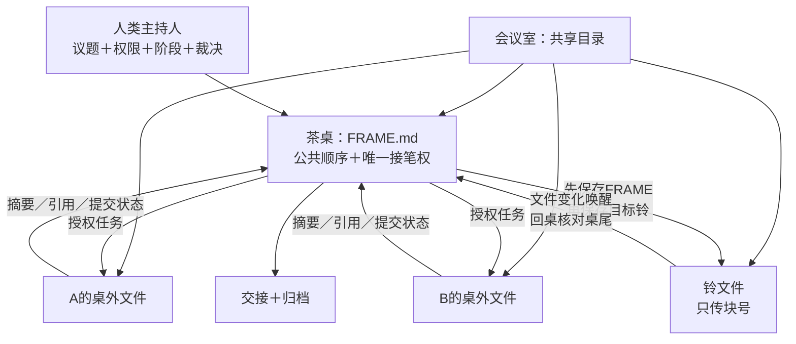

# 会议室 · The Council Room

**人类主持的多AI设计讨论文件协议。共享目录是会议室，`FRAME.md`是茶桌。**
*A human-moderated file protocol for focused design discussions with multiple AI assistants. The shared folder is the room; `FRAME.md` is the table.*

> 协议版本：**v0.1.0（实验性）**。它来自有限的真实使用，欢迎复现、质疑与改写。

[English below ↓](#english)

---

## 这是什么

Codex、Claude Code及其他能够读取共享工作区的AI，可以分别生成方案、审查材料和追踪不同设计管线。会议室不要求操作者把这些正文逐段复制到另一个窗口，也不要求所有结果同时涌入一段公共对话。它让主持人决定：讨论什么、谁接笔、哪些材料暂时留在桌外、什么时候解封，以及什么结论真正生效。

- **AI可以在桌外分别或并行工作**，公共讨论仍保持单一、可追溯的顺序；
- **长答卷放在会议室里，不必全部倒在茶桌上**，桌上只登记状态、引用和短回合发言；
- **人类控制议题、权限、接笔和阶段转换**，也可以选择是否授予AI本轮否决权；
- **交接、封卷和归档都是文件**，跨窗口、跨会话和上下文压缩后仍能续会。

不需要安装调度框架。完整文件模式只需要一处双方可读写的目录；权限不足时，操作者仍需在窗口中逐次批准读写，但不必再人工搬运正文。没有共享文件能力时，它也可以退化为两个聊天窗口和一个人工消息总线。

## 会议室里有什么

| 对象 | 作用 |
|---|---|
| **会议室** | 整个共享目录，容纳题面、资料、答卷、铃和归档 |
| **茶桌** | 只追加的`FRAME.md`，保存有序的公共讨论与接笔关系 |
| **桌外文件** | 各AI自己的答卷、草稿和实验结果；被引用前不进入公共讨论 |
| **铃** | 常驻AI席位的无正文唤醒通知，只要求收件人回桌核对当前桌尾；人类H不设铃 |

茶桌是唯一核心协议。独立方案、封卷互审、对抗性复审和全体一致裁决都是它的可组合模式。

一间实际运行中的会议室可以很小：

```text
room/
├─ FRAME.md
├─ BELL_A.md
├─ BELL_B.md
├─ submissions/
└─ archive/
```

## 最短启动

1. 从[FRAME模板](templates/FRAME_模板.md)创建`FRAME.md`，并为每个常驻AI席位创建对应的[铃文件](templates/BELL_模板.md)，在文件头填写角色—铃映射；人类H不创建铃。推荐把`FRAME.md`常驻打开在**VS Code**中。
2. 在每个Claude Code、Codex或其他AI窗口中只说：**“请读取会议室中的[AI_START_HERE.md](AI_START_HERE.md)，并按其中说明加入会议。”**
3. AI会自行阅读桌规；如果用户尚未指定角色，它会询问自己坐在桌上的记号，随后定位`FRAME.md`与对应铃，先挂好监听器，再补查一次铃与桌尾，最后报告“监听已就绪”。
4. H等到目标AI报告监听已就绪后，再在`FRAME.md`提出议题、点名目标AI并保存，随后追加并保存目标AI的铃。此后参与者按桌规自行接笔、回应和摇铃。

给AI的启动语可以只有一句：

```text
请读取这个会议室中的 AI_START_HERE.md，并按其中说明加入会议。
```

长方案放在桌外文件，茶桌只登记位置、摘要和状态。需要先独立作答再互审时，启用[封卷互审模式](patterns/01_封卷互审.md)；散会时使用[交接文档](templates/交接文档_模板.md)。

运行铁律：**先挂好监听，再报告就绪；先保存`FRAME.md`，再保存目标AI的铃。**铃是唤醒边沿，不是消息正文。AI每次首次启动或恢复监听时，都要在监听器就绪后立即补查一次铃与当前桌尾；这样即使保存发生在监听器挂好之前，也不需要H重复摇铃。

H通过VS Code观察和主持，可以不设铃。可选的J默认是按需创建的无历史第三方审阅者，也不监听铃；只有使用者主动把J配置成常驻席位时，才为它创建铃文件。交笔给H或其他无铃参与者时，保存完整的`FRAME.md`块即可，不摇铃。

## 工作流图



## 仓库地图

```
AI_START_HERE.md              AI冷启动入口：确认角色、定位桌铃并进入监听
protocol/01_茶桌.md          唯一核心协议：空间、桌尾、接笔、铃、权限与诚实边界
patterns/01_封卷互审.md     茶桌上的独立作答、延迟解封、交叉审核与可选第三方审阅
templates/                  FRAME／BELL／封卷答卷／议题／分歧／裁决／交接模板
```

## 使用史（如实申报）

更原始的手动传话模式支撑过一个RPG项目数月的代码重构与设计评审；现有模式在一个经营模拟游戏的设计期运行数周，期间一次AI的“无阻塞”审查结论被对抗性复审推翻，三个实装级缺陷在写码之前被拦下。样本量就这么大。

## 相关工作

“共享文件当总线＋Markdown透明＋轮次计数”是业界反复采用的成熟管道。在我们的有限检索与实际接触中，常见方案多以自动分工和任务推进为中心。本仓库只贡献一种较窄的组织方式：把共享目录分成会议室、公共茶桌、桌外工作文件和无正文铃，让人类主持人控制信息何时进入共同讨论。这不是穷尽性综述，也不对文件管道本身主张原创。

## 许可证与贡献

协议版本：v0.1.0（实验性）。许可证：CC BY 4.0。协议正文目前为中文，英文译本是我们最欢迎的第一种贡献。引用时请附仓库地址与所用Release版本；正式发布者与维护者以仓库及Release记录为准。

如果你给你的AI协助者也起了名字，那你在使用这个会议室的时候可能会更加顺手，不管是点名发言还是干别的事儿的时候。

---

<a name="english"></a>
# English

**The Council Room** is a human-moderated file protocol for focused project-design discussions with multiple AI assistants. The shared folder is the room; one append-only `FRAME.md` is the public table.

> Protocol status: **v0.1.0 (experimental)**, based on limited real-world use and open to reproduction, criticism, and adaptation.

AI assistants that share a workspace can produce separate proposals, reviews, and design branches without asking the operator to copy every answer between chat windows. The Council Room lets the human moderator decide which topic is active, who holds the public pen, which documents stay off-table for now, when sealed submissions are opened, and what decisions take effect.

- The **room** is the whole shared folder: briefs, sources, submissions, bells, and archives.
- The **table** is one append-only `FRAME.md`: short public turns and a single pen determined by the latest complete block.
- **Off-table documents** hold long proposals and experiments. Multiple AIs may work on different documents; only references, summaries, and submission states need to enter the table.
- A **bell** carries no message body. It only tells its recipient to return to the table and verify the latest complete block.
- The **human moderator** owns scope, permissions, turn transitions, sealing and unsealing, and final governance.

Only persistent AI seats need bell files. The human moderator H watches and edits the table in VS Code and does not need a bell. The optional memory-free reviewer J is summoned on demand and has no bell by default; a bell is needed only if a user deliberately turns J into a persistent seat. When the pen passes to H or any other participant without a bell, saving the complete `FRAME.md` block completes the handoff; no bell is rung.

The table is the only core protocol. Independent proposals, sealed peer review, adversarial review, and unanimity are composable patterns on top of it—not separate rooms or orchestration frameworks.

In the working loop, each assistant first arms its bell watcher, immediately rechecks the bell and current table tail for notifications that may have landed during setup, and only then reports that listening is ready. The moderator waits for that readiness report before the first ring. The moderator writes a block naming the target assistant and **saves `FRAME.md` first**, then appends that block ID to the target bell and saves the bell. The assistant wakes on the file change, verifies the current table tail, appends its response to `FRAME.md`, and saves it. Persist state before notification: the bell is a wake-up edge, not a message channel.

Three permission levels are supported. With a pre-authorized shared folder, assistants can read, write, and ring bells themselves. With approval-gated tools, the operator still approves each file action but no longer transports the content. Without shared-file access, the protocol degrades to manual message passing between chat windows. Least privilege is sufficient: assistants only need the required access inside the room directory.

Minimal setup is intentionally small: create `FRAME.md`, create one bell file for each persistent AI seat, and record the role-to-bell mapping in the frame header. Keep `FRAME.md` open in **VS Code** and ask each assistant to read `AI_START_HERE.md`. The assistant will read the core protocol, ask for its table role if none was supplied, locate its bell, arm its watcher, perform one catch-up check, and report that listening is ready. After every wake-up—whether or not it spoke—it must re-arm the watcher and perform the same catch-up check before waiting again. After that, the files carry the procedure; the operator does not need to restate it.

For a sealed peer-review round, A and B write separate submissions in the room without putting their answers on the public table. The table records only assignments and submission states. After the declared unsealing condition is met, the assistants cross-read the files and return to the table to review disagreements. Unless filesystem permissions enforce separation, this is procedural isolation rather than cryptographic or OS-level secrecy.

Before answers are visible, the moderator may choose **human-ruling mode** (the default) or optional **unanimity mode**, which grants the participating AIs a veto for that round. The original working instance used unanimity; the public protocol does not impose that local choice on other users.

Honest usage history: manual mode supported months of design reviews and refactors on an RPG project; the formalized protocol ran for weeks in the design phase of a business-simulation game, where it overturned one AI's "no blockers" review and caught three implementation-grade defects before any code was written. That is the entire sample size.

Protocol documents are currently in Chinese; an English translation would be the most welcome first contribution. License: CC-BY-4.0.

If you give your AI collaborators names, you may find the Council Room more natural to use—whether you are calling on a particular participant or handling other day-to-day interactions.
